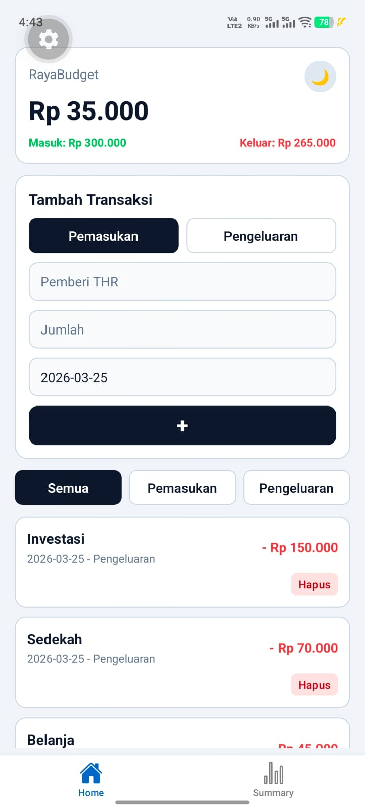
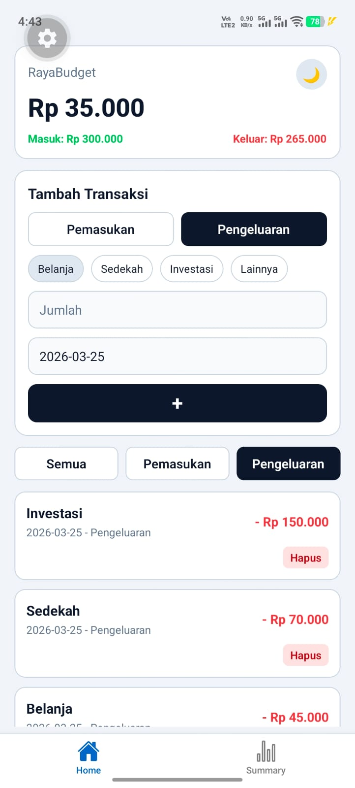
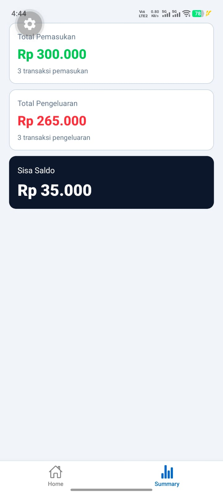
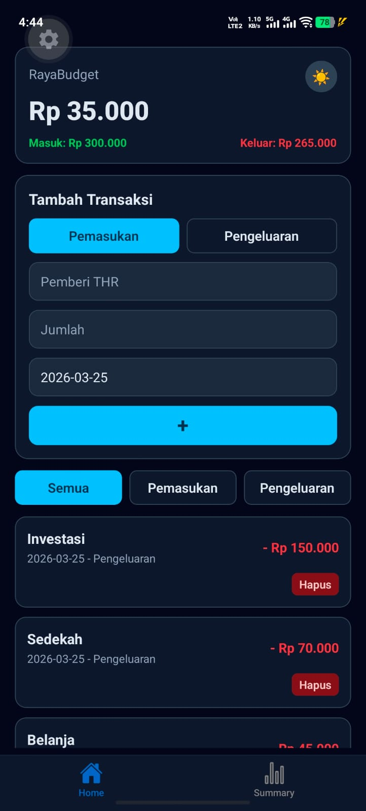
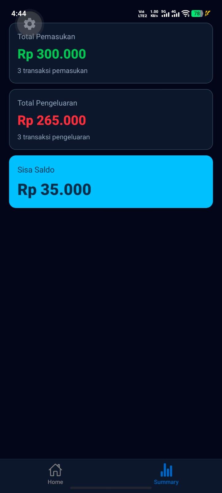

# RayaBudget - THR Minggu 4 State Management
## Informasi Mahasiswa
- Nama : Muhammad Kevin
- NIM : 2410501040
- Opsi : B - RayaBudget
## Deskripsi Aplikasi
RayaBudget adalah aplikasi manajemen uang THR (Tunjangan Hari Raya) untuk mencatat pemasukan dan pengeluaran selama hari raya. Pengguna dapat menambahkan transaksi, melihat ringkasan saldo, memfilter transaksi berdasarkan tipe (pemasukan/pengeluaran), dan menghapus transaksi.
## Hooks yang Digunakan
- useState: digunakan di `TransactionForm` untuk mengelola state input (type, from, category, amount, date) dan di `ThemeContext` untuk mengatur dark mode.
- useEffect: digunakan di `RayaBudgetProvider` untuk load dan persist transaksi melalui `AsyncStorage`.
- useReducer: digunakan di `RayaBudgetProvider` dengan action types: `LOAD_DATA`, `ADD_INCOME`, `ADD_EXPENSE`, `DELETE_TRANSACTION`.
- Custom Hook: `useWallet()` untuk menghitung `total saldo`, `total masuk`, `total keluar` serta menyediakan fungsi `addIncome`, `addExpense`, dan `deleteTransaction`.
## Screenshot

### 1. Tampilan Home dengan Tab Tambah Pemasukan (Light Mode)

### 2. Tampilan Home dengan Tab Tambah Pengeluaran, serta filter transaksi pengeluaran di Tab Transaksi (Light Mode)

### 3. Tab Summary (Light Mode)

### 4. Tampilan Home dengan Tab Tambah Pemasukan (Dark Mode)

### 5. Tab Summary (Dark Mode)

## Cara Menjalankan
npm install && npx expo start